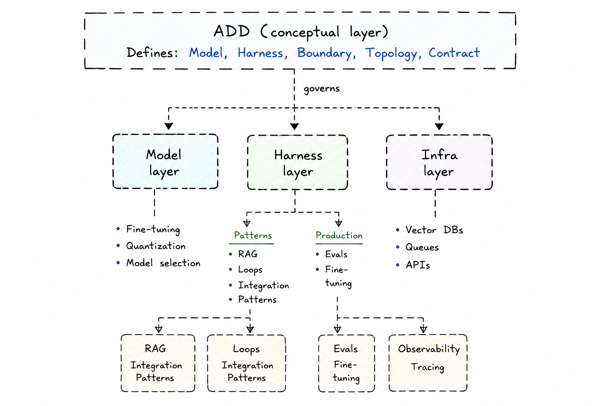

# Agent-Driven Design (ADD)

A conceptual framework for designing systems where LLM-based agents are first-class architectural citizens — and a collection of runnable examples that show how the framework applies in practice.

> **The central thesis:** every agent is composed of exactly two parts — a **Model** and a **Harness**. Getting their responsibilities right is the core design problem.

---

## What is ADD?

Domain-Driven Design gave us vocabulary for decomposing complex software around business domains. ADD does the same for agentic systems — answering questions DDD was not designed for:

- When does logic belong in the model's reasoning versus in code?
- Where do you draw the boundary between two agents?
- When is a single agent enough, and when do you decompose?
- How do RAG, fine-tuning, evals, and observability fit into the architecture?

ADD is not a framework library. It is a design language.

---

## Core Concepts

| Concept | Definition |
|---|---|
| **Model** | The LLM. Responsible for reasoning, generation, and judgment. |
| **Harness** | All code surrounding the Model: prompts, tools, memory, routing, validation. |
| **Agent** | Always `Model + Harness`. Neither alone is an agent. |
| **Agent Context Boundary** | The conceptual scope of what an agent knows, can do, and owns. |
| **Agent Topology** | How agents are arranged and connected in a system. |

The decision rule: *Does this require reasoning or judgment?* → Model. *Is this structure, flow, or contract?* → Harness. *Does this serve the Harness?* → Infra.

---

## Where Everything Fits



```
┌─────────────────────────────────────────────────────────────┐
│                   ADD (conceptual layer)                     │
│         Model │ Harness │ Boundary │ Topology               │
└────────┬──────────────┬────────────────────┬────────────────┘
         │              │                    │
    ┌────▼────┐    ┌─────▼──────┐     ┌──────▼──────┐
    │  Model  │    │   Harness  │     │    Infra    │
    │  layer  │    │   layer    │     │    layer    │
    └─────────┘    └────────────┘     └─────────────┘
         │              │                    │
   Fine-tuning      RAG patterns        Observability
   Tokenizer        Integration         Evals infra
   Quantization     Memory patterns     Tracing
                    Loop patterns       Vector DBs
```

---

## Repository Structure

```
agent-driven-design/
├── core/                    # Framework concepts and glossary
├── patterns/
│   ├── rag/                 # Retrieval-Augmented Generation as a Harness pattern
│   ├── integration/         # Connecting agents to external systems
│   ├── memory/              # Episodic, semantic, and working memory
│   └── loops/               # Agentic loop patterns (ReAct, plan-execute, reflection)
├── production/
│   ├── evals/               # Model eval vs Agent eval vs System eval
│   ├── observability/       # What the Harness must expose and why
│   └── fine-tuning/         # When and why to move logic from Harness into Model
├── guides/                  # How everything connects to ADD
└── examples/                # Runnable code
    ├── single-agent/        # Claude, OpenAI, LangChain
    ├── multi-agent/         # LangGraph, hierarchical
    ├── loops/               # ReAct, plan-execute, reflection — manual + LangGraph
    └── observability/       # Langfuse, LangSmith, Phoenix, OpenTelemetry
```

---

## Runnable Examples

All examples are in Python. Each one is annotated to show where Model and Harness responsibilities begin and end.

| Example | Provider | Pattern |
|---|---|---|
| [single-agent/claude](examples/single-agent/claude/) | Anthropic | Basic agent with tools |
| [single-agent/openai](examples/single-agent/openai/) | OpenAI | Basic agent with tools |
| [single-agent/langchain](examples/single-agent/langchain/) | Agnostic | LangChain abstraction |
| [multi-agent/langgraph](examples/multi-agent/langgraph/) | Agnostic | Orchestrator + workers |
| [multi-agent/hierarchical](examples/multi-agent/hierarchical/) | Anthropic | Hierarchical topology |
| [loops/react/manual](examples/loops/react/manual/) | Anthropic | ReAct loop from scratch |
| [loops/react/langgraph](examples/loops/react/langgraph/) | Agnostic | ReAct with LangGraph |
| [loops/plan-execute/manual](examples/loops/plan-execute/manual/) | Anthropic | Plan-execute from scratch |
| [loops/reflection/manual](examples/loops/reflection/manual/) | Anthropic | Reflection loop from scratch |
| [observability/langfuse](examples/observability/langfuse/) | Any | Tracing with Langfuse |
| [observability/langsmith](examples/observability/langsmith/) | Any | Tracing with LangSmith |
| [observability/phoenix](examples/observability/phoenix/) | Any | Tracing with Arize Phoenix |
| [observability/opentelemetry](examples/observability/opentelemetry/) | Any | OTel-native tracing |

---

## Status

Early-stage research framework. Concepts are stable; documentation and examples are actively developed. Contributions, critiques, and counterexamples are welcome.

See [CONTRIBUTING.md](CONTRIBUTING.md).

---

## License

MIT
