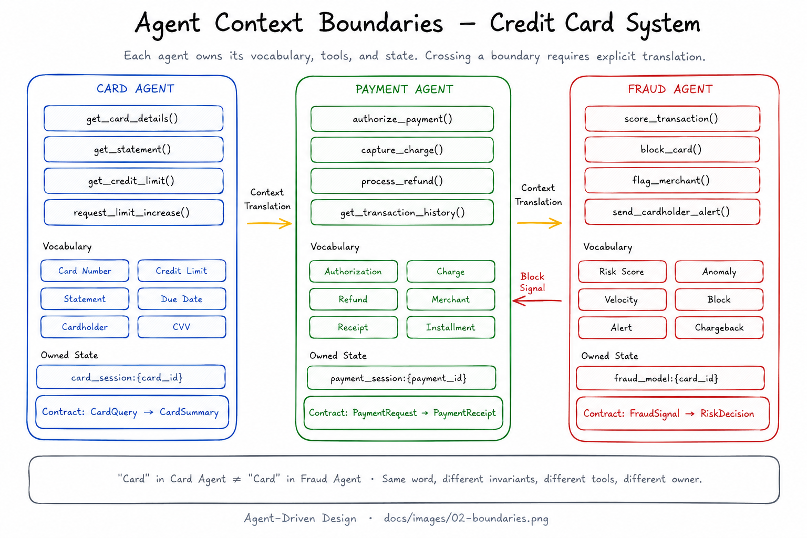

# 02 — Agent Context Boundaries

## What is a Boundary?

An Agent Context Boundary defines the scope within which an agent operates coherently. Inside the boundary, the agent has:

- A well-defined vocabulary (what terms mean within this context)
- A constrained set of tools (what actions are available)
- A clear objective (what success looks like)
- Owned state (what memory this agent reads and writes)

Outside the boundary, those things do not apply — or apply differently. A "customer" in a billing context and a "customer" in a support context may share a name but carry different data, different invariants, and different operational meaning. Forcing a single agent to straddle both contexts creates the same problems as a god class: it works until it doesn't, and when it breaks it breaks in ways that are hard to reason about.

---

## Why Boundaries Matter

### Context window as working memory

The Model operates within a fixed context window. What you put in that window determines what the Model can reason about. A boundary is, in part, a discipline about what belongs in the window — and what doesn't.

When a context boundary leaks, the window fills with terms, constraints, and tool definitions that belong to adjacent domains. The Model becomes confused about which rules apply. Outputs degrade. Prompt complexity grows to compensate. The boundary exists to keep the window focused.

### Evolvability

When an agent is bounded, you can change it — retrain it, swap the model, modify the prompt, add tools — without affecting agents in other boundaries. The boundary is an isolation unit. Without it, changes propagate unpredictably.

### Ownership

A boundary implies an owner. If two teams or two subsystems share an unbounded agent, neither owns it cleanly. Boundaries enable clear ownership of agent behavior.

---

## Defining a Boundary

A well-defined Agent Context Boundary answers four questions:

1. **What does this agent know?**
   The vocabulary, entities, and relationships that live in this context. Write them down. If a term means something different here than it does in another context, that difference is significant.

2. **What can this agent do?**
   The tools available to it. Tools are the agent's interface with the world. A billing agent has billing tools; it does not have fulfillment tools.

3. **What does this agent own?**
   The state it reads and writes. If two agents write to the same memory store for the same key, you have a boundary problem.

4. **How does this agent communicate with the outside?**
   The inputs it accepts and the outputs it produces. These are the contract. Anything outside the contract is not this agent's concern.

---

## Boundary Signals

You may need to draw or redraw a boundary when you observe:

- An agent consistently producing outputs that reference concepts from another domain
- A system prompt growing to accommodate multiple distinct objectives
- Two agents competing for the same memory keys
- Tool lists that span unrelated capability areas
- Difficulty writing evals because the agent's expected behavior depends too much on context

---

## Cross-Boundary Communication

When agents in different boundaries need to communicate, translation is required. This is the ADD equivalent of the DDD Anti-Corruption Layer.

There are three patterns:

### 1. Context Translation Prompt

The Harness constructs a prompt that translates the output of one agent into the vocabulary of another. The translation is explicit and versioned. Neither agent knows about the other.

```
Agent A output (in A's vocabulary)
    → Harness translates
    → Agent B input (in B's vocabulary)
```

### 2. Shared Contract Object

Both agents communicate through a structured schema that neither domain owns. The schema is minimal — only the fields needed for the handoff. Both Harnesses are responsible for mapping between their internal representations and the contract object.

### 3. Orchestrator Agent

A third agent whose entire job is coordination. It understands the contracts of multiple agents, routes work, and assembles results. It does not do domain work itself.

---

## Boundary vs. Agent Decomposition

A boundary is a design concept. An agent is a runtime artifact. They do not always map 1:1.

A single boundary can be served by multiple agents (for parallelism or specialization). A single agent can bridge two boundaries intentionally (when the cost of decomposition is too high). What matters is that the boundary is explicit and the translation is deliberate — not that the implementation is always one-to-one.

---

## Example: Mapping a Boundary

For a Card Agent operating in a credit card system:

| Element | Value |
|---|---|
| **Vocabulary** | Card Number, Credit Limit, Statement, Due Date, Cardholder, CVV |
| **Tools** | `get_card_details()`, `get_statement()`, `get_credit_limit()`, `request_limit_increase()` |
| **Owned state** | `card_session[card_id]` |
| **Inputs accepted** | `CardQuery` (structured) |
| **Outputs produced** | `CardSummary` (structured) |
| **Out of scope** | Payment authorization, fraud scoring, transaction history |

Payment is a separate boundary served by a Payment Agent (`authorize_payment()`, `process_refund()`). Fraud detection is a separate boundary served by a Fraud Agent (`score_transaction()`, `block_card()`). If the Card Agent needs to trigger a payment, it produces a structured `CardQuery` output that the Harness routes to the Payment Agent — it does not reach into payment tools directly.

Note: "Card" means something different in the Card Agent (account entity, credit limit, statement) than in the Fraud Agent (risk surface, velocity indicator). Same word, different invariants, different tools, different owner. This is why the boundary exists.



---

## Anti-Patterns

### Boundary sprawl
An agent whose tools span multiple unrelated domains. Fix: split the tool surface along domain lines and create separate agents.

### Implicit translation
Two agents communicate in natural language without a defined contract. One agent's output becomes another's prompt directly. Fix: define a structured handoff schema; translation is the Harness's job.

### Shared mutable state
Multiple agents write to the same memory location. Fix: assign ownership. One agent writes; others read through a defined retrieval interface.

---

**Next:** [03 — When and How to Decompose](./03-decomposition.md)
