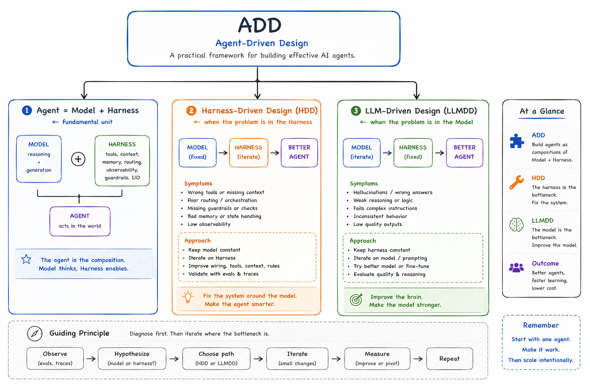

# Harness-Driven Design vs. LLM-Driven Design



Every improvement to an agent is either a Harness change or a Model change. Knowing which one to make — and in what order — is the core design skill in ADD.

---

## The two design modes

### Harness-Driven Design (HDD)

**When the problem is in the Harness.**

The Model is reasoning correctly given what it receives. The problem is in what it receives, what tools it has, or how outputs are handled.

```
Model (unchanged) → better Harness → better Agent
```

**Symptoms:**
- Wrong or missing context in the prompt
- Poor routing or orchestration decisions
- Missing, poorly defined, or incorrectly scoped tools
- Bad memory or state handling across turns
- Prompt quality issues — vague instructions, missing constraints

**Response:**
- Keep the Model constant
- Improve prompts, tools, context construction, routing rules
- Fix memory retrieval, guardrails, output validation

**Goal:** Work around the Model's limitations. Make the agent smarter without touching the Model.

---

### LLM-Driven Design (LDD)

**When the problem is in the Model.**

The Harness is giving the Model the right context, the right tools, and the right instructions — and the Model still produces wrong outputs. The failure is in the Model's reasoning, knowledge, or behavior.

```
Harness (unchanged) → better Model → better Agent
```

**Symptoms:**
- Hallucinations or factually wrong answers despite correct context
- Fails complex multi-step instructions that are clearly stated
- Inconsistent behavior on the same input across runs
- Low quality scores on evals after Harness is already optimized
- Domain vocabulary the base model does not know reliably

**Response:**
- Keep the Harness constant
- Try a better base model, or fine-tune on the specific failure mode
- Evaluate reasoning quality, not just output format

**Goal:** Improve the brain. Make the Model stronger for this specific context.

---

## The decision rule

```
Eval fails
    │
    ├── Is the Model receiving the right context, tools, and instructions?
    │       NO → Harness problem → HDD
    │
    └── Is the Model receiving everything correctly but still failing?
            YES → Model problem → LDD
                  (only after HDD has been exhausted)
```

**HDD is the default.** Most agent failures are Harness failures. Go to LDD only after HDD has been fully explored — because Harness changes are faster, cheaper, and reversible. Fine-tuning is expensive and couples the Model to the current Harness.

---

## The improvement cycle

```
Observe          Hypothesize       Choose path      Iterate
(evals, traces)  (HDD or LDD?)     (HDD or LDD)     (small changes)
      │                │                 │                │
      └────────────────┴─────────────────┴────────────────┘
                                                          │
                                                    Measure
                                                 (improve or pivot)
                                                          │
                                                       Repeat
```

1. **Observe** — run evals, read traces. Identify exactly where the failure occurs.
2. **Hypothesize** — is this a context problem (HDD) or a reasoning problem (LDD)?
3. **Choose path** — commit to one. Do not change Model and Harness simultaneously.
4. **Iterate** — make small, targeted changes.
5. **Measure** — re-run evals. Did the score improve?
6. **Repeat** — if improved, continue. If not, reconsider the hypothesis.

Changing Model and Harness at the same time makes it impossible to know which change caused the improvement or regression.

---

## How HDD and LDD fit into ADD

```
ADD
├── Agent = Model + Harness          ← the fundamental unit
├── Harness-Driven Design (HDD)      ← when the problem is in the Harness
└── LLM-Driven Design (LDD)          ← when the problem is in the Model
```

ADD defines the architecture. HDD and LDD define the design strategies for improving it. Every agent improvement is one or the other — never both at once.

---

## At a glance

| | HDD | LDD |
|---|---|---|
| **Problem is in** | Harness | Model |
| **What you change** | Prompts, tools, routing, memory, context | Model version, fine-tuning |
| **What stays fixed** | Model | Harness |
| **When to use** | Default — try first | After HDD is exhausted |
| **Cost** | Low — code changes | High — training cost, coupling risk |
| **Reversibility** | High | Low |

---

**Remember:** Start with what you can control. Make it work. Then make the Model stronger.

See also: [How Everything Connects](./how-everything-connects.md) · [Fine-Tuning in ADD](../production/fine-tuning/README.md) · [Evals in ADD](../production/evals/README.md)
