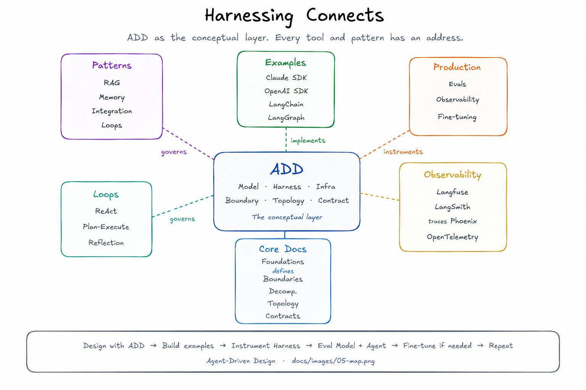

# How Everything Connects

A map of how all ADD concepts and patterns relate to each other.



## The layers

```
┌─────────────────────────────────────────────────────────────┐
│                   ADD (conceptual layer)                     │
│  Defines: Model, Harness, Boundary, Topology, Contract      │
└────────────────────────┬────────────────────────────────────┘
                         │ governs
         ┌───────────────┼───────────────┐
         ▼               ▼               ▼
   ┌───────────┐   ┌───────────┐   ┌───────────┐
   │   Model   │   │  Harness  │   │   Infra   │
   │   layer   │   │   layer   │   │   layer   │
   └───────────┘   └─────┬─────┘   └─────┬─────┘
         │               │               │
   Fine-tuning      ┌────┴────┐      Vector DBs
   Quantization     │         │      Queues
   Model selection  │         │      APIs
                 Patterns  Production
                    │         │
              ┌─────┴─┐   ┌──┴──────┐
              │       │   │         │
             RAG   Loops  Evals  Observability
          Integration     Fine-   Tracing
           Patterns      tuning
```

## Every concept has an address

### If you're asking "where does this logic live?"
→ Use the [decision rule](../core/docs/01-foundations.md): Model / Harness / Infra

### If you're asking "how do I structure multiple agents?"
→ See [Agent Context Boundaries](../core/docs/02-boundaries.md) and [Topology](../core/docs/04-topology.md)

### If you're asking "when do I split into multiple agents?"
→ See [Decomposition](../core/docs/03-decomposition.md)

### If you're asking "how do I implement retrieval?"
→ See [RAG pattern](../patterns/rag/README.md) — RAG is a Harness pattern

### If you're asking "how do I implement a loop?"
→ See [Loop patterns](../patterns/loops/README.md) — loops are Harness

### If you're asking "how do I observe what my agent is doing?"
→ See [Observability](../production/observability/README.md) and [examples](../examples/observability/)

### If you're asking "how do I know if my agent is working correctly?"
→ See [Evals](../production/evals/README.md)

### If you're asking "should I fine-tune?"
→ See [Fine-tuning](../production/fine-tuning/README.md) — only after ruling out Harness fixes

### If you're asking "is this a Harness problem or a Model problem?"
→ See [HDD vs LDD](./hdd-vs-ldd.md) — the two design strategies in ADD

## The development loop

```
1. Design                    Use ADD concepts to map the domain
   └── What is the agent's context boundary?
   └── What tools does it need?
   └── What topology is required?
   └── Which loop pattern fits?

2. Build                     Implement with any framework
   └── Single-agent: see examples/single-agent/
   └── Multi-agent: see examples/multi-agent/
   └── Loops: see examples/loops/

3. Observe                   Instrument the Harness
   └── Every agent run is a trace
   └── Every Model call is a span
   └── Every tool call is a span

4. Eval                      Test Model, Agent, System
   └── Run agent evals against your traces
   └── LLM-as-Judge for quality scoring
   └── Attach scores to traces

5. Improve
   └── Harness problem? → fix prompt, tools, retrieval, routing
   └── Model problem? → better base model or fine-tuning
   └── Boundary problem? → redesign context boundaries

6. Go to 3
```

## The fine-tuning decision

```
Eval fails
    │
    ├─ Is the Model reasoning correctly given the prompt?
    │   NO → Harness problem (fix prompt, context, tools)
    │
    └─ Is the Model reasoning correctly but producing wrong format/style?
        YES → Fine-tuning candidate
              (only if: >100 examples, consistent failure pattern,
               cannot fix with better prompting)
```

## ADD is not a framework

ADD does not require LangChain, LangGraph, or any specific library. The examples use these tools because they are popular and well-suited, but every concept in ADD can be implemented with any language and any framework — or no framework at all.

The examples in `examples/loops/react/manual/` show a ReAct loop with nothing but the Anthropic SDK. No framework. The concepts are the same.
