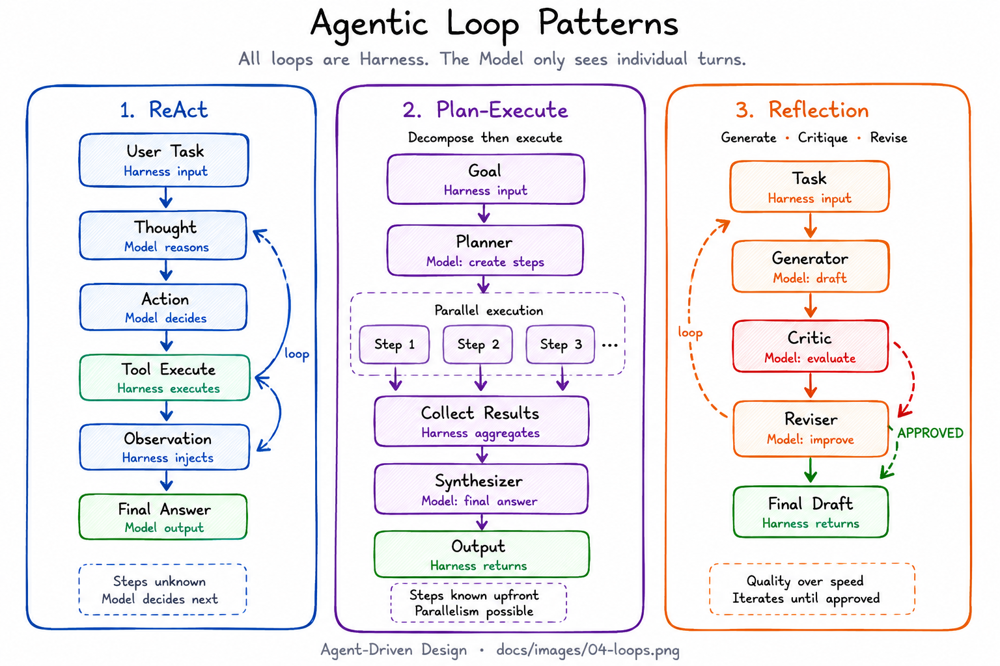

# Agentic Loop Patterns



An agentic loop is the mechanism by which a Harness drives repeated Model calls until a stopping condition is met. The loop itself is always Harness — the Model only sees individual turns within the loop.

## The three fundamental loops

### ReAct (Reason + Act)
The Model alternates between reasoning (Thought) and acting (tool calls). The Harness drives the loop and injects tool results as Observations.

```
Harness sends context
    → Model: Thought + Action
    → Harness: execute tool → Observation
    → Model: Thought + Action (or Final Answer)
    → repeat until Final Answer or max steps
```

Best for: tasks where the number of steps is unknown and the Model must decide what to do next at each step.

### Plan-Execute
The Model first produces a complete plan, then executes each step. Planning and execution are separate Model calls.

```
Harness sends goal
    → Model (Planner): produces ordered step list
    → Harness: for each step, construct execution context
    → Model (Executor): executes step, uses tools if needed
    → Harness: collects results
    → Model (Synthesizer): produces final answer from all results
```

Best for: tasks that can be decomposed upfront, where parallelism is possible, and where plan quality matters.

### Reflection (Generate-Critique-Revise)
The Model generates a draft, a second Model call critiques it, a third revises it. Iterates until the critique approves or max iterations.

```
Harness sends task
    → Model (Generator): produces draft
    → Model (Critic): evaluates draft → APPROVED or NEEDS_REVISION
    → if NEEDS_REVISION: Model (Reviser): produces improved draft
    → repeat until APPROVED or max iterations
```

Best for: tasks where output quality matters more than speed (writing, analysis, code review).

## Stopping conditions

All stopping conditions are Harness logic:

- **Explicit signal** — Model produces a designated end marker ("Final Answer:", APPROVED)
- **Max iterations** — Harness enforces a hard cap
- **Convergence** — Harness detects the output is no longer changing
- **Tool result** — a specific tool result signals completion

Never rely on the Model to stop itself without an explicit signal. Models will continue reasoning if not stopped.

## Loop anti-patterns

**Infinite loops** — no stopping condition or stopping condition the Model can bypass. Always enforce a Harness-level max iterations.

**Progress-blind loops** — the loop runs but the Model makes no progress. Add Harness-level progress detection (e.g., has the output changed? have new tools been called?).

**Over-looping** — using ReAct for a task that could be a single Model call. Measure whether the loop adds quality before paying the latency cost.

## Examples

See `examples/loops/` for runnable implementations:
- `react/manual` — ReAct from scratch with Anthropic SDK
- `react/langgraph` — ReAct as a LangGraph state machine
- `plan-execute/manual` — Plan-Execute from scratch
- `reflection/manual` — Reflection loop from scratch
